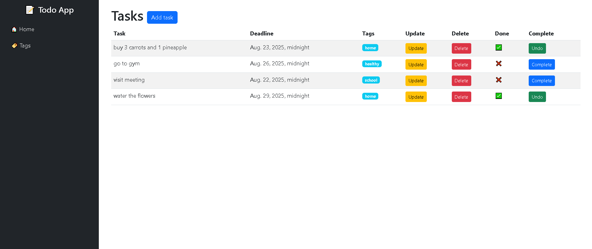
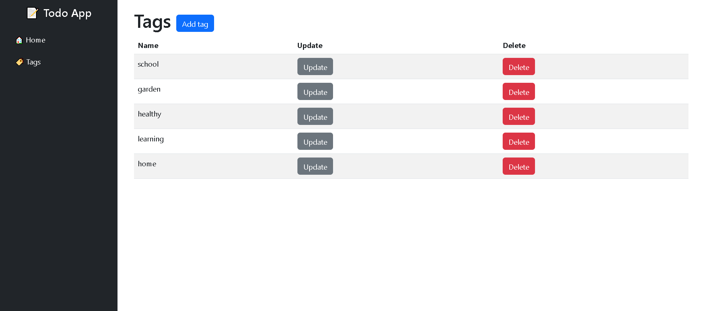

# Todo List

Django project for managing tags and tasks.


## Installation 

Python3 must be already installed 

```shell
git clone https://github.com/iivitalik/todo-list.git
cd todo-list
python3 -m venv venv
source venv/bin/activate  # On Windows use `venv\Scripts\activate`
pip install -r requirements.txt
python manage.py runserver
```


## Demo


